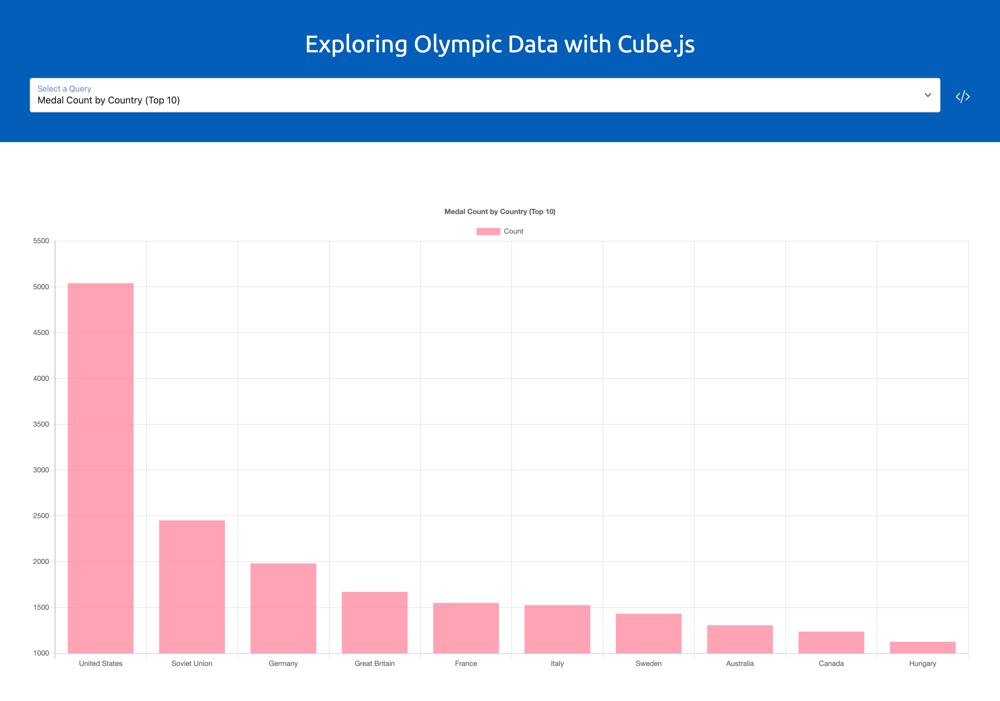

# Demo of CubeJS

## About

This a demo of CubeJS being utilized in an Angular application to demonstrate the ability for an Angular application to query for data 
and manipulate it to be used with visualization library (in this case, ng2-charts). This demo provides:

* A rudimentary query and visualization switching system to demonstrate dynamically loading data from CubeJS
* The CubeJS backend and playground environment that can be used to explore different queries
* A data set that can be loaded into your database of choice for CubeJS to query against

## What is CubeJS?
Cube describes itself as a tool “primarily used to build internal business intelligence tools or add customer-facing analytics to existing applications.” Cube provides a playground for building visualizations, but also provides the API layer to build your own custom visualizations using whichever visualization library or frontend framework you want.

## Setup

Data needs to be imported into your database of choice. Simply import the provided `athlete_events.csv` file under data into a table. 
Then, edit the `.env` file under the `cube` folder with the correct database information.

There are two different processes that need to run for the demo to work:

1. The Angular application, which can be run by using `ng serve` in the `ui` folder
2. The CubeJS backend and playground, which can be run using `npm run dev` in the `cube` folder

Before running these, be sure to do `npm install` in the folder to install the dependencies.

## Accessing the Demo

By default, the web app will run at [localhost:4200](http://localhost:4200) and CubeJS's playground will run at [localhost:4000](http://localhost:4000).
